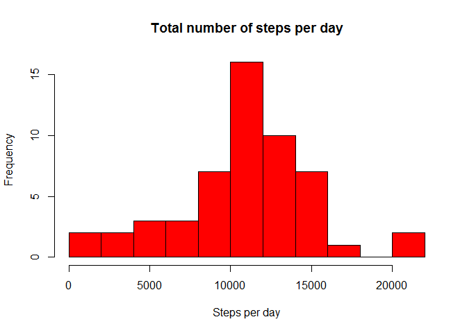
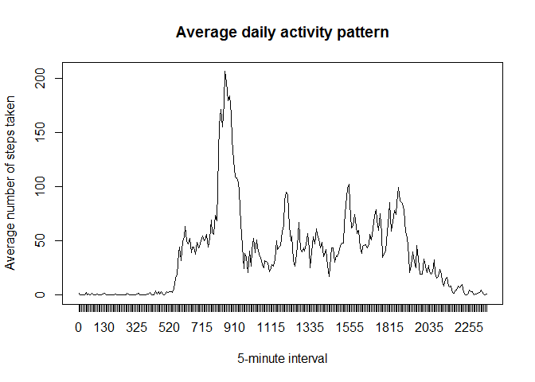
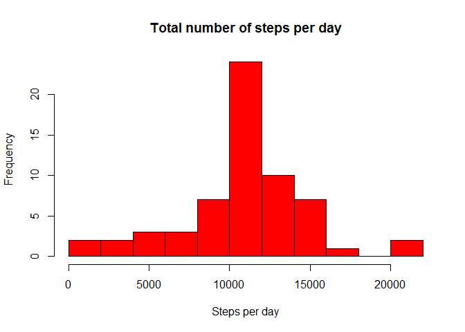
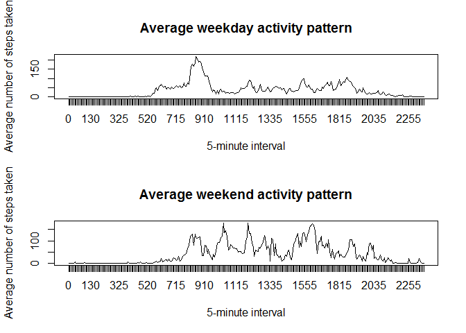

# Reproducible Research: Peer Assessment 1


## Loading and preprocessing the data


```r
# 1. Unzip the data in your working directory
# 2. Load the data

data <- read.csv("activity.csv")
```


## What is mean total number of steps taken per day?


```r
# 1. Make a histogram of the total number of steps taken each day

sdata <- split(data$steps, data$date)
sdata1 <- sapply(sdata, sum)
hist(sdata1, breaks=10, xlab="Steps per day",main="Total number of steps per day", col="red")
```

 

```r
# 2. Calculate and report the mean and median total number of steps taken per day

# Calculate the mean (ignore missing values)
mean(sdata1, na.rm = TRUE)
```

```
## [1] 10766.19
```

```r
# Median
median(sdata1, na.rm = TRUE)
```

```
## [1] 10765
```


## What is the average daily activity pattern?


```r
# 1. Make a time series plot (i.e. type = "l") of the 5-minute interval (x-axis) and the average number of steps taken, averaged across all days (y-axis)

idata <- split(data$steps, data$interval)
idata1 <- sapply(idata, mean, na.rm = TRUE)

plot(idata1, xaxt="n", type="l", xlab="5-minute interval", ylab="Average number of steps taken", main="Average daily activity pattern")
axis(1, at=1:288, labels=names(idata1))
```

 

```r
# 2. Which 5-minute interval, on average across all the days in the dataset, contains the maximum number of steps?

names(idata1)[which.max(idata1)]
```

```
## [1] "835"
```


## Imputing missing values


```r
# 1. Calculate and report the total number of missing values in the dataset (i.e. the total number of rows with NAs)
sum(is.na(data$steps))
```

```
## [1] 2304
```

```r
# Devise a strategy for filling in all of the missing values in the dataset

### The strategy is to use the mean for that 5-minute interval

# Create a new dataset that is equal to the original dataset but with the missing data filled in.

### The dataset "dataC" is equal to the original dataset but with the missing data filled in

dataC<-data
df<-as.data.frame(idata1)
df[,2]<-rownames(df)
colnames(df)<-c("mean", "interval")


for (i in 1:17568){
  y<-data$interval[i]
if(is.na(data$steps[i])==TRUE) {dataC$steps[i]<-df$mean[df[,2]==y]
}
}


# Make a histogram of the total number of steps taken each day and Calculate and report the mean and median total number of steps taken per day. Do these values differ from the estimates from the first part of the assignment? What is the impact of imputing missing data on the estimates of the total daily number of steps?


### 1. Make a histogram of the total number of steps taken each day

sdataC <- split(dataC$steps, dataC$date)
sdataC1 <- sapply(sdataC, sum)
hist(sdataC1, breaks=10, xlab="Steps per day",main="Total number of steps per day", col="red")
```

 

```r
### 2. Calculate and report the mean and median total number of steps taken per day

### Calculate the mean
mean(sdataC1)
```

```
## [1] 10766.19
```

```r
### Median
median(sdataC1)
```

```
## [1] 10766.19
```

```r
###  Do these values differ from the estimates from the first part of the assignment? What is the impact of imputing missing data on the estimates of the total daily number of steps?

### They difer only slightly. The imputing of missing data does not change the results.
```


## Are there differences in activity patterns between weekdays and weekends?


```r
# 1. Create a new factor variable in the dataset with two levels - "weekday" and "weekend" indicating whether a given date is a weekday or weekend day.

dataC[,4]<-weekdays(as.Date(dataC$date))

for (i in 1:17568){
    if(dataC$V4[i]=="Saturday") {dataC$V4[i]<-"weekend"
  }
  if(dataC$V4[i]=="Sunday") {dataC$V4[i]<-"weekend"
  }
  else {dataC$V4[i]<-"weekday"}
}
dataC$V4<-as.factor(dataC$V4)


# Make a panel plot containing a time series plot (i.e. type = "l") of the 5-minute interval (x-axis) and the average number of steps taken, averaged across all weekday days or weekend days (y-axis). The plot should look something like the following, which was creating using simulated data:

dataWE<-dataC[dataC$V4=="weekend",]
dataWD<-dataC[dataC$V4=="weekday",]

idataWE <- split(dataWE$steps, dataWE$interval)
idata1WE <- sapply(idataWE, mean)

idataWD <- split(dataWD$steps, dataWD$interval)
idata1WD <- sapply(idataWD, mean)

par (mfrow=c(2,1))

plot(idata1WD, xaxt="n", type="l", xlab="5-minute interval", ylab="Average number of steps taken", main="Average weekday activity pattern")
axis(1, at=1:288, labels=names(idata1))

plot(idata1WE, xaxt="n", type="l", xlab="5-minute interval", ylab="Average number of steps taken", main="Average weekend activity pattern")
axis(1, at=1:288, labels=names(idata1))
```

 

